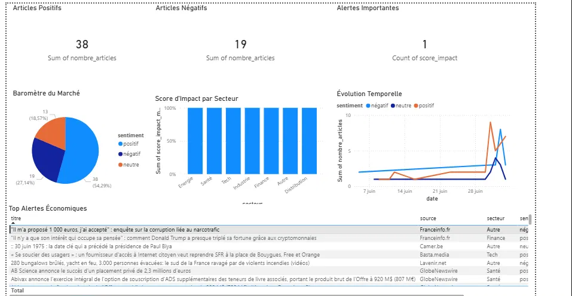

# Veille Économique LLM Lakehouse

[](https://azure.microsoft.com)
[](https://databricks.com)
[](https://spark.apache.org)
[](https://delta.io)
[](https://databricks.com/product/unity-catalog)
[](https://mistral.ai)
[](https://powerbi.microsoft.com)
[](LICENSE)

Plateforme de veille économique intelligente construite sur **Azure Databricks**, ingérant des articles de presse financière française via **NewsAPI**, les analysant avec **Mistral AI** (sentiment, secteur, score d'impact), et exposant les résultats via un **dashboard Power BI** connecté en DirectQuery.

---

## Table des matières

- [Vue d'ensemble](#vue-densemble)
- [Architecture](#architecture)
- [Getting Started](#getting-started)
- [Pipeline Medallion](#pipeline-medallion)
- [Analyse Mistral AI](#analyse-mistral-ai)
- [Stack technique](#stack-technique)
- [Résultats du pipeline](#résultats-du-pipeline)
- [Dashboard Power BI](#dashboard-power-bi)
- [Structure du projet](#structure-du-projet)
- [Améliorations futures](#améliorations-futures)
- [Auteur](#auteur)

---

## Vue d'ensemble

Ce projet implémente une plateforme de veille économique end-to-end sur Azure Databricks.

Il ingère des articles de presse financière française en temps réel via **NewsAPI**, les transforme à travers les couches Bronze, Silver et Gold, puis enrichit chaque article grâce à **Mistral AI** pour en extraire le sentiment, le secteur économique, un résumé automatique et un score d'impact business.

Les KPIs agrégés alimentent un **dashboard Power BI** connecté en DirectQuery sur les tables Gold Delta Lake.

---

## Architecture

```
NewsAPI (articles presse FR)
          ↓
    Bronze Delta Table
    (données brutes)
          ↓
    Silver Delta Table
    (nettoyage + standardisation)
          ↓
    Gold — Mistral AI analyse chaque article
    (sentiment + secteur + résumé + score)
          ↓
    Gold KPIs agrégés
    (baromètre + secteurs + alertes + temporel)
          ↓
    Power BI Dashboard (DirectQuery)
```

---

## Getting Started

### Prérequis

- Un **workspace Azure Databricks** avec Unity Catalog activé
- Un cluster avec **Databricks Runtime 13.0+**
- Un compte **NewsAPI** gratuit — https://newsapi.org
- Un compte **Mistral AI** gratuit — https://console.mistral.ai
- **Power BI Desktop** installé

### 1. Cloner le repo dans Databricks

1. Dans votre workspace Databricks → **Workspace** → **Repos** → **Add Repo**
2. Entrez : `https://github.com/djguerch-ops/veille-economique-llm-lakehouse`
3. Cliquez **Create Repo**

### 2. Créer la structure Unity Catalog

Exécutez dans un notebook Databricks :

```python
spark.sql("CREATE CATALOG IF NOT EXISTS veille_eco")
spark.sql("CREATE SCHEMA IF NOT EXISTS veille_eco.bronze")
spark.sql("CREATE SCHEMA IF NOT EXISTS veille_eco.silver")
spark.sql("CREATE SCHEMA IF NOT EXISTS veille_eco.gold")
print("✅ Structure Unity Catalog créée !")
```

### 3. Obtenir les clés API

**NewsAPI (gratuit) :**
1. Allez sur https://newsapi.org
2. Créez un compte gratuit
3. Copiez votre clé API

**Mistral AI (gratuit) :**
1. Allez sur https://console.mistral.ai
2. Créez un compte gratuit
3. Allez dans **API Keys** → **Create new key**
4. Copiez votre clé API

### 4. Exécuter les notebooks dans l'ordre

| Étape | Notebook | Description |
|-------|----------|-------------|
| 1 | `01_bronze_ingestion.py` | Ingestion des articles via NewsAPI |
| 2 | `02_silver_transformation.py` | Nettoyage et standardisation |
| 3 | `03_gold_analyse_mistral.py` | Analyse LLM de chaque article |
| 4 | `04_gold_kpis.py` | Agrégation des KPIs pour Power BI |

### 5. Connecter Power BI

1. Ouvrez **Power BI Desktop** → **Get Data** → **Databricks**
2. Entrez votre **Server hostname** et **HTTP Path** (depuis SQL Warehouses → Connection details)
3. Choisissez **DirectQuery**
4. Authentifiez-vous avec un **Personal Access Token**
5. Importez les 5 tables Gold :
   - `veille_eco.gold.articles_enrichis`
   - `veille_eco.gold.kpi_sentiment`
   - `veille_eco.gold.kpi_secteurs`
   - `veille_eco.gold.kpi_alertes`
   - `veille_eco.gold.kpi_temporal`

---

## Pipeline Medallion

### Couche Bronze

Ingestion brute des articles de presse financière française via NewsAPI.

- 5 requêtes par thème : `economie france`, `bourse paris`, `CAC40`, `entreprise france`, `finance france`
- 100 articles maximum par thème (plan gratuit NewsAPI)
- Déduplication par URL
- Métadonnées ajoutées : `ingestion_timestamp`
- Table : `veille_eco.bronze.articles`

### Couche Silver

Nettoyage et standardisation des articles bruts.

- Filtrage des titres et descriptions null ou trop courts
- Standardisation des timestamps
- Nettoyage des espaces et caractères parasites
- Déduplication par URL
- Table : `veille_eco.silver.articles`

### Couche Gold

**Table 1 — Articles enrichis par Mistral AI :**
Chaque article Silver est analysé individuellement par Mistral (`mistral-small-latest`).
Table : `veille_eco.gold.articles_enrichis`

**Table 2 — KPI Sentiment :**
Baromètre global : % positif / négatif / neutre.
Table : `veille_eco.gold.kpi_sentiment`

**Table 3 — KPI Secteurs :**
Score d'impact moyen, distribution des sentiments par secteur économique.
Table : `veille_eco.gold.kpi_secteurs`

**Table 4 — KPI Alertes :**
Articles à fort impact (score ≥ 7) classés par score décroissant.
Table : `veille_eco.gold.kpi_alertes`

**Table 5 — KPI Temporel :**
Évolution du nombre d'articles et du sentiment jour par jour.
Table : `veille_eco.gold.kpi_temporal`

---

## Analyse Mistral AI

Mistral AI est utilisé comme **brique de transformation intelligente** dans la couche Gold.

Pour chaque article, Mistral analyse le titre et la description et retourne un JSON structuré :

```python
prompt = """Analyse cet article de presse français et réponds en JSON :
{
  "sentiment": "positif" ou "négatif" ou "neutre",
  "secteur": "Tech" ou "Finance" ou "Energie" ou "Santé" ou "Distribution" ou "Industrie" ou "Autre",
  "resume": "résumé en 1 phrase maximum",
  "score_impact": nombre entier de 1 à 10,
  "mots_cles": "3 mots clés séparés par des virgules"
}
Titre : {titre}
Description : {description}"""
```

**Exemple de résultat Mistral :**

```json
{
  "sentiment": "positif",
  "secteur": "Santé",
  "resume": "Abivax finalise une levée de fonds record de 920M€ pour financer ses essais cliniques.",
  "score_impact": 9,
  "mots_cles": "Abivax, biotech, financement"
}
```

**Modèle utilisé :** `mistral-small-latest` (plan gratuit)
**Délai entre appels :** 2 secondes (respect du rate limiting)

---

## Stack technique

| Technologie | Rôle |
|-------------|------|
| Azure Databricks | Traitement distribué et orchestration |
| Apache Spark / PySpark | Transformation des données à l'échelle |
| Delta Lake | ACID transactions et time travel |
| Unity Catalog | Gouvernance et contrôle d'accès |
| NewsAPI | Source d'articles de presse financière |
| Mistral AI | Analyse LLM (sentiment, secteur, résumé) |
| Power BI | Dashboard analytique (DirectQuery) |

---

## Résultats du pipeline

### Exécution Bronze
```
✅ 'economie france' → 8 articles
✅ 'bourse paris'    → 20 articles
✅ 'CAC40'          → 5 articles
✅ 'entreprise france' → 20 articles
✅ 'finance france'  → 18 articles
Total après déduplication : 71 articles
Table : veille_eco.bronze.articles
```

### Exécution Silver
```
Bronze articles  : 71
Silver articles  : 70
Articles rejetés : 1
Table : veille_eco.silver.articles
```

### Exécution Gold — Analyse Mistral
```
70/70 articles analysés par Mistral AI ✅
Table : veille_eco.gold.articles_enrichis
```

### Distribution des sentiments
```
Positif  : 38 articles (54%)
Négatif  : 19 articles (27%)
Neutre   : 13 articles (19%)
```

### Distribution des secteurs
```
Tech         : 24 articles — score moyen 7.21
Santé        :  6 articles — score moyen 7.83
Finance      :  6 articles — score moyen 6.83
Industrie    :  6 articles — score moyen 7.00
Distribution :  5 articles — score moyen 6.40
Énergie      :  1 article  — score moyen 8.00
```

---

## Dashboard Power BI

Le dashboard Power BI est connecté en **DirectQuery** sur les 5 tables Gold.



**Visuels disponibles :**

| Visuel | Table | Description |
|--------|-------|-------------|
| KPI Cards | `kpi_sentiment` | Articles positifs, négatifs, alertes |
| Baromètre (Donut) | `kpi_sentiment` | Distribution sentiment global |
| Score par secteur (Bar) | `kpi_secteurs` | Score d'impact moyen par secteur |
| Évolution temporelle (Line) | `kpi_temporal` | Tendance sentiment jour par jour |
| Top alertes (Table) | `kpi_alertes` | Articles à fort impact (score ≥ 7) |

---

## Structure du projet

```
veille-economique-llm-lakehouse/
│
├── notebooks/
│   ├── 01_bronze_ingestion.py
│   ├── 02_silver_transformation.py
│   ├── 03_gold_analyse_mistral.py
│   └── 04_gold_kpis.py
│
├── images/
│   └── dashboard.png
│
├── LICENSE
└── README.md
```

---

## Améliorations futures

- [ ] Ingestion temps réel avec Databricks Structured Streaming
- [ ] Enrichissement avec données boursières Yahoo Finance
- [ ] Alertes automatiques par email (score_impact ≥ 9)
- [ ] Support multilingue (EN, DE, ES)
- [ ] Remplacement NewsAPI par flux RSS via Azure Event Hub
- [ ] CI/CD avec GitHub Actions + Databricks Asset Bundles
- [ ] Monitoring pipeline avec Databricks Lakehouse Monitoring

---

## Auteur

**Djamel Guerchouche**
Data Engineer

Spécialisé dans les plateformes data cloud-native, le traitement distribué et l'intégration LLM dans les pipelines data.

- 🔗 [LinkedIn](https://www.linkedin.com/in/djamel-guerchouche-863559b6/)
- 🐙 [GitHub](https://github.com/djguerch-ops)

**Expertise :**
Azure · Databricks · Apache Spark · Delta Lake · Unity Catalog · Mistral AI · Python · Power BI

---

*Construit avec ❤️ en utilisant Azure Databricks, PySpark, Delta Lake et Mistral AI.*
